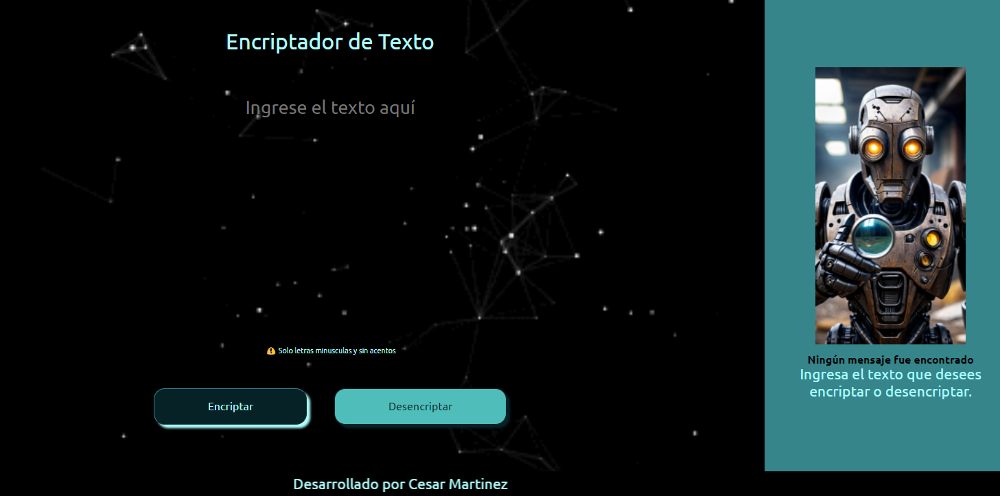

<h1>CHALLENGE</h1>

- Entregable aplicación de lo enseñado por Alura LATAM como principiante:

Este proyecto aplica HTML, CSS y funciones de JavaScript para el desarrollo
de un encriptador de texto (Margen izquierda) que cifra palabras y pasa el mensaje cifrado a
una otra columna (Margen Derecho), donde una vez procesado se activa un botón de 
copiado, permitiendo tomar este mismo mensaje y pasandolo a la columna de encriptación 
para ahora desencriptar dicho texto y resolver el enigma.
Alura nos presenta una imagen modelo de la cual se debe partir para moldear nuestro
HTML, sin embargo yo modifique la imagen para hacerla mas atractiva, dandole una 
sensación de modernidad y ambiente digital. Tambien adicione un gif animado de fondo
y un footer tambien animado que le da dinamismo visual a la pagina.

Espero sea de su agrado. 

